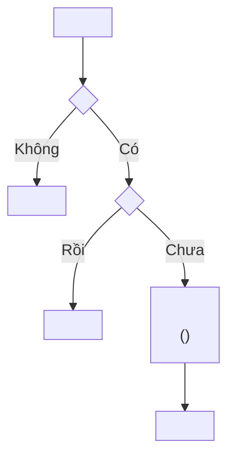

# Vẽ Activity Diagram

## Lấy context trong project

1. Xác định `projectId`; gọi `document_first_list_projects` nếu cần.
2. Có mã tài liệu thì dùng `document_first_fetch`; dùng `document_first_get_story` để đọc Story có cấu trúc, gồm flow, AC và reference. Dùng `document_first_search` khi cần tìm tài liệu liên quan.
3. Duyệt Business Rule bằng `document_first_list_rules` với `limit`/`offset`, rồi đọc chi tiết bằng `documentKeys` (tối đa 20 mã/lần). Khi kiểm tra xung đột hoặc traceability, duyệt đủ các trang; search không chứng minh được danh sách đầy đủ.
4. Cần thêm TDD, reference và tài liệu liên quan cho Story thì dùng `document_first_prepare_story_context` (contract `2026-09-05`, `evidence.readDocuments`). Context có giới hạn; đọc bổ sung tài liệu cần thiết.
5. Mọi thành viên project được đọc tài liệu ở Draft, InReview, Approved và đã lưu trữ. Không yêu cầu phê duyệt hoặc Release để dùng nội dung làm căn cứ. Ghi lại trạng thái thực tế, không mô tả tài liệu chưa duyệt là đã duyệt.
6. Truy vết bằng `documentKey#contentHash`; `approvalId` chỉ ghi khi có. `missingKeys`/`unresolvedReferences` là phần chưa lấy được, không tự suy đoán nội dung. `resolved` chỉ phản ánh liên kết đã tìm thấy tài liệu đích.

Dùng main/alternative/exception flow và điều kiện trong rule để xác định bước xử lý, nhánh quyết định và điểm kết thúc.

## Chọn phạm vi

Activity diagram trả lời câu hỏi "các bước và nhánh rẽ". Nếu câu hỏi thực sự là "ai gọi ai,
message gì", dùng `draw-sequence-diagram`. Nếu là "vòng đời trạng thái của một thực thể", dùng
`draw-state-diagram`.

Xác định trước khi vẽ:

- một điểm vào duy nhất và toàn bộ điểm kết thúc;
- các quyết định bắt buộc, lấy từ `When` của Business Rule và các phần tử `flows.exception`;
- ranh giới: diagram mô tả logic bên trong thành phần nào.

## Quy ước vẽ



- `flowchart TD` cho luồng đọc từ trên xuống.
- `[...]` cho hành động, `{...}` cho quyết định; không dùng ngược lại.
- Mỗi node quyết định phải là câu hỏi có/không hoặc liệt kê đủ nhánh; mọi nhánh đều có nhãn.
- Mọi đường đi phải kết thúc ở một node kết thúc rõ ràng, không để nhánh cụt.
- Nhãn chứa dấu ngoặc, dấu phẩy, dấu hai chấm hoặc `<br/>` phải bọc trong dấu nháy kép.
- Ghi mã lỗi và mã Business Rule ngay trong nhãn khi bước đó thực thi rule, ví dụ
  `Trả 401 INVALID_SIGNATURE` hoặc `(BR-03)`.
- Nêu rõ bước nào chạy trong cùng một database transaction thay vì để người đọc tự đoán.

## Kiểm tra trước khi trả

- Mọi bước trong `flows.main` đều xuất hiện hoặc được gộp có chủ ý.
- Mọi phần tử `flows.alternative` và `flows.exception` bắt buộc đều có đường đi tương ứng.
- Không có node quyết định nào thiếu nhánh.
- Xử lý idempotency và trường hợp lặp lại được thể hiện nếu luồng có webhook hoặc retry.
- Cú pháp Mermaid hợp lệ, render được, không phụ thuộc theme màu.

## Bàn giao

Trả diagram trong code block ```mermaid sẵn sàng dán vào mục `## Activity Diagram` của TDD, kèm:

- một đoạn ngắn nói diagram nhấn mạnh điều gì;
- `documentKey#contentHash` và `approvalId` nếu có, của nguồn đã dùng;
- các bước suy ra từ source code chứ không từ tài liệu hiện tại.

## Khi được yêu cầu lưu vào Document First

Nếu người dùng yêu cầu tạo hoặc cập nhật tài liệu trong project, thực hiện ghi qua MCP theo
[manage-documents](../manage-documents/SKILL.md), rồi trả mã tài liệu và kết quả đã lưu.
Chỉ soạn để xem hoặc dry-run thì dùng định dạng bàn giao ở trên.
