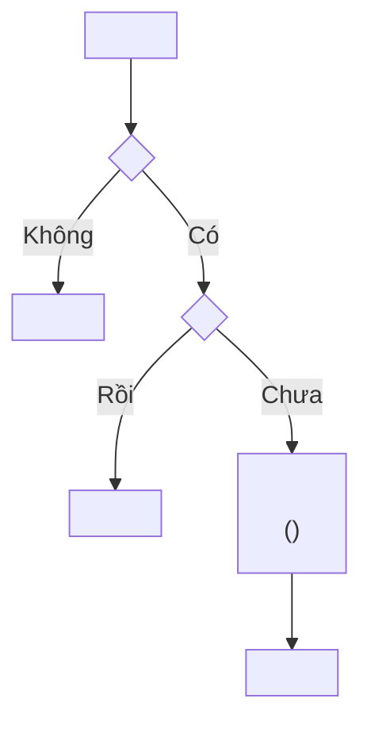

# Vẽ Activity Diagram

## Lấy nguồn chuẩn

1. Xác định `projectId`; gọi `document_first_list_projects` nếu cần.
2. Khi có Story, gọi `document_first_get_story`: `flows.main` cho chuỗi bước, `flows.alternative`
   và `flows.exception` cho các nhánh rẽ, `conditions.preconditions` cho điều kiện đầu vào.
3. Đọc rule quyết định nhánh rẽ bằng `document_first_list_rules` với `documentKeys` từ
   `references.rules`; `When`/`Then`/`Except` của rule chính là các node quyết định.
4. Khi luồng cần vẽ nằm trong TDD chứ không thuộc Story nào, dùng `document_first_search` rồi
   `document_first_fetch` với `contentHash` để đọc TDD đó.
5. Chỉ vẽ theo nội dung Approved. Nêu rõ phần nào suy ra từ source code của repository đang mở.
6. Không yêu cầu Release, GitHub commit hoặc liên kết GitHub repository.

## Chọn phạm vi

Activity diagram trả lời câu hỏi "các bước và nhánh rẽ". Nếu câu hỏi thực sự là "ai gọi ai,
message gì", dùng `draw-sequence-diagram`. Nếu là "vòng đời trạng thái của một thực thể", dùng
`draw-state-diagram`.

Xác định trước khi vẽ:

- một điểm vào duy nhất và toàn bộ điểm kết thúc;
- các quyết định bắt buộc, lấy từ `When` của Business Rule và các phần tử `flows.exception`;
- ranh giới: diagram mô tả logic bên trong thành phần nào.

## Quy ước vẽ



- `flowchart TD` cho luồng đọc từ trên xuống.
- `[...]` cho hành động, `{...}` cho quyết định; không dùng ngược lại.
- Mỗi node quyết định phải là câu hỏi có/không hoặc liệt kê đủ nhánh; mọi nhánh đều có nhãn.
- Mọi đường đi phải kết thúc ở một node kết thúc rõ ràng, không để nhánh cụt.
- Nhãn chứa dấu ngoặc, dấu phẩy, dấu hai chấm hoặc `<br/>` phải bọc trong dấu nháy kép.
- Ghi mã lỗi và mã Business Rule ngay trong nhãn khi bước đó thực thi rule, ví dụ
  `Trả 401 INVALID_SIGNATURE` hoặc `(BR-03)`.
- Nêu rõ bước nào chạy trong cùng một database transaction thay vì để người đọc tự đoán.

## Kiểm tra trước khi trả

- Mọi bước trong `flows.main` đều xuất hiện hoặc được gộp có chủ ý.
- Mọi phần tử `flows.alternative` và `flows.exception` bắt buộc đều có đường đi tương ứng.
- Không có node quyết định nào thiếu nhánh.
- Xử lý idempotency và trường hợp lặp lại được thể hiện nếu luồng có webhook hoặc retry.
- Cú pháp Mermaid hợp lệ, render được, không phụ thuộc theme màu.

## Bàn giao

Trả diagram trong code block ```mermaid sẵn sàng dán vào mục `## Activity Diagram` của TDD, kèm:

- một đoạn ngắn nói diagram nhấn mạnh điều gì;
- `documentKey#contentHash` và `approvalId` đã dùng;
- các bước suy ra từ source code chứ không từ tài liệu đã phê duyệt.
