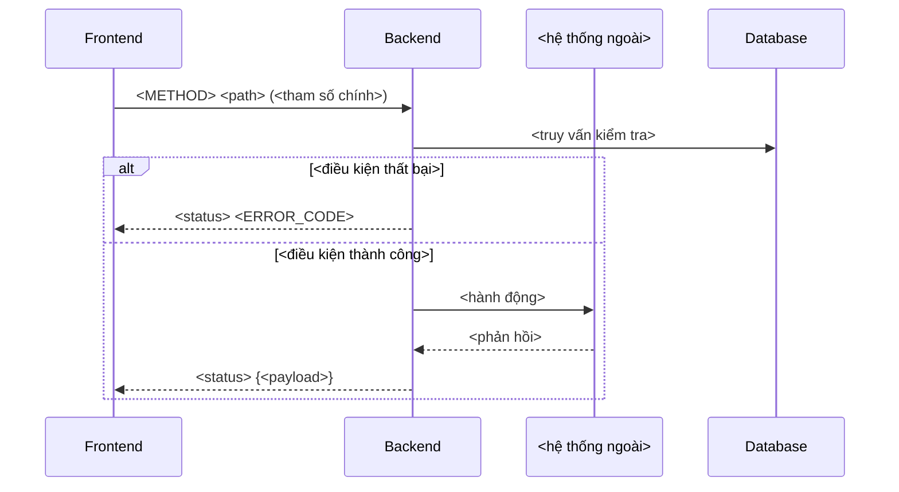

# Vẽ Sequence Diagram

## Lấy nguồn chuẩn

1. Xác định `projectId`; gọi `document_first_list_projects` nếu cần.
2. Khi có Story, gọi `document_first_get_story`: `flows.main` cho luồng chính, `flows.exception`
   và `flows.alternative` cho các nhánh phải thể hiện bằng `alt/else`.
3. Đọc rule chi phối bằng `document_first_list_rules` với `documentKeys` từ `references.rules`.
   Lấy registry `Error Codes` từ TDD qua `document_first_search` rồi `document_first_fetch`.
4. Chỉ vẽ theo nội dung Approved. Nêu rõ phần nào suy ra từ source code của repository đang mở.
5. Không yêu cầu Release, GitHub commit hoặc liên kết GitHub repository.

## Chọn phạm vi

Sequence diagram trả lời câu hỏi "ai gọi ai, message gì". Nếu câu hỏi thực sự là "các bước và
nhánh rẽ bên trong một thành phần", dùng `draw-activity-diagram`. Nếu là "vòng đời trạng thái của
một thực thể", dùng `draw-state-diagram`.

Xác định trước khi vẽ:

- danh sách participant và đúng vai trò của từng participant;
- điểm bắt đầu và điểm kết thúc của luồng;
- các nhánh rẽ bắt buộc phải thể hiện, lấy từ `flows.exception` và `flows.alternative` của Story.

## Quy ước vẽ



- `->>` cho request, `-->>` cho response; giữ nhất quán toàn diagram.
- Đặt alias ngắn cho participant (`FE`, `BE`, `DB`, `EXT`) và khai báo tất cả ở đầu.
- Mỗi message ghi rõ nội dung nghiệp vụ, không để trống hoặc ghi chung chung "gọi API".
- Nhánh lỗi phải kèm HTTP status và mã lỗi đúng như `Error Codes` trong TDD.
- Dùng `alt/else` cho rẽ nhánh, `loop` cho lặp, `Note over` cho ràng buộc quan trọng như
  idempotency hoặc transaction boundary.
- Tự gọi chính mình (`BE->>BE`) chỉ dùng cho bước xử lý nội bộ có ý nghĩa với người đọc, ví dụ
  verify signature.

## Kiểm tra trước khi trả

- Mọi participant khai báo đều có ít nhất một message.
- Mọi phần tử `flows.exception` bắt buộc đều xuất hiện hoặc được nêu rõ là cố ý lược bỏ, gọi tên
  bằng `code` của nhánh.
- Mỗi mã lỗi trong diagram tồn tại trong registry `Error Codes` của TDD.
- Nhãn chứa dấu ngoặc, dấu hai chấm hoặc xuống dòng phải bọc trong dấu nháy kép.
- Cú pháp Mermaid hợp lệ, render được, không phụ thuộc theme màu.

## Bàn giao

Trả diagram trong code block ```mermaid sẵn sàng dán vào mục `## Sequence Diagram` của TDD, kèm:

- một đoạn ngắn nói diagram nhấn mạnh điều gì;
- `documentKey#contentHash` và `approvalId` đã dùng;
- các bước suy ra từ source code chứ không từ tài liệu đã phê duyệt.
