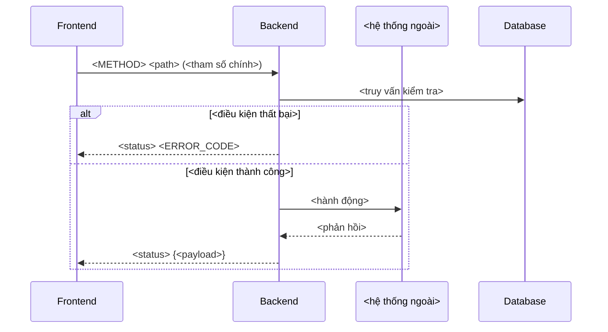

# Vẽ Sequence Diagram

## Lấy context trong project

1. Xác định `projectId`; gọi `document_first_list_projects` nếu cần.
2. Có mã tài liệu thì dùng `document_first_fetch`; dùng `document_first_get_story` để đọc Story có cấu trúc, gồm flow, AC và reference. Dùng `document_first_search` khi cần tìm tài liệu liên quan.
3. Duyệt Business Rule bằng `document_first_list_rules` với `limit`/`offset`, rồi đọc chi tiết bằng `documentKeys` (tối đa 20 mã/lần). Khi kiểm tra xung đột hoặc traceability, duyệt đủ các trang; search không chứng minh được danh sách đầy đủ.
4. Cần thêm TDD, reference và tài liệu liên quan cho Story thì dùng `document_first_prepare_story_context` (contract `2026-09-05`, `evidence.readDocuments`). Context có giới hạn; đọc bổ sung tài liệu cần thiết.
5. Mọi thành viên project được đọc tài liệu ở Draft, InReview, Approved và đã lưu trữ. Không yêu cầu phê duyệt hoặc Release để dùng nội dung làm căn cứ. Ghi lại trạng thái thực tế, không mô tả tài liệu chưa duyệt là đã duyệt.
6. Truy vết bằng `documentKey#contentHash`; `approvalId` chỉ ghi khi có. `missingKeys`/`unresolvedReferences` là phần chưa lấy được, không tự suy đoán nội dung. `resolved` chỉ phản ánh liên kết đã tìm thấy tài liệu đích.

Dùng `flows.main` cho luồng chính, `flows.alternative`/`flows.exception` cho `alt/else`. Đọc endpoint và registry Error Codes từ TDD.

## Chọn phạm vi

Sequence diagram trả lời câu hỏi "ai gọi ai, message gì". Nếu câu hỏi thực sự là "các bước và
nhánh rẽ bên trong một thành phần", dùng `draw-activity-diagram`. Nếu là "vòng đời trạng thái của
một thực thể", dùng `draw-state-diagram`.

Xác định trước khi vẽ:

- danh sách participant và đúng vai trò của từng participant;
- điểm bắt đầu và điểm kết thúc của luồng;
- các nhánh rẽ bắt buộc phải thể hiện, lấy từ `flows.exception` và `flows.alternative` của Story.

## Quy ước vẽ



- `->>` cho request, `-->>` cho response; giữ nhất quán toàn diagram.
- Đặt alias ngắn cho participant (`FE`, `BE`, `DB`, `EXT`) và khai báo tất cả ở đầu.
- Mỗi message ghi rõ nội dung nghiệp vụ, không để trống hoặc ghi chung chung "gọi API".
- Nhánh lỗi phải kèm HTTP status và mã lỗi đúng như `Error Codes` trong TDD.
- Dùng `alt/else` cho rẽ nhánh, `loop` cho lặp, `Note over` cho ràng buộc quan trọng như
  idempotency hoặc transaction boundary.
- Tự gọi chính mình (`BE->>BE`) chỉ dùng cho bước xử lý nội bộ có ý nghĩa với người đọc, ví dụ
  verify signature.

## Kiểm tra trước khi trả

- Mọi participant khai báo đều có ít nhất một message.
- Mọi phần tử `flows.exception` bắt buộc đều xuất hiện hoặc được nêu rõ là cố ý lược bỏ, gọi tên
  bằng `code` của nhánh.
- Mỗi mã lỗi trong diagram tồn tại trong registry `Error Codes` của TDD.
- Nhãn chứa dấu ngoặc, dấu hai chấm hoặc xuống dòng phải bọc trong dấu nháy kép.
- Cú pháp Mermaid hợp lệ, render được, không phụ thuộc theme màu.

## Bàn giao

Trả diagram trong code block ```mermaid sẵn sàng dán vào mục `## Sequence Diagram` của TDD, kèm:

- một đoạn ngắn nói diagram nhấn mạnh điều gì;
- `documentKey#contentHash` và `approvalId` nếu có, của nguồn đã dùng;
- các bước suy ra từ source code chứ không từ tài liệu hiện tại.

## Khi được yêu cầu lưu vào Document First

Nếu người dùng yêu cầu tạo hoặc cập nhật tài liệu trong project, thực hiện ghi qua MCP theo
[manage-documents](../manage-documents/SKILL.md), rồi trả mã tài liệu và kết quả đã lưu.
Chỉ soạn để xem hoặc dry-run thì dùng định dạng bàn giao ở trên.
