# Vẽ State Diagram

## Lấy nguồn chuẩn

1. Xác định `projectId`; gọi `document_first_list_projects` nếu cần.
2. Lấy **toàn bộ** Business Rule của project bằng `document_first_list_rules` ở chế độ duyệt, lặp
   `offset` cho tới khi đủ `total`. Rule chi phối chuyển trạng thái hay nằm rải rác và không có
   từ khoá chung, nên duyệt hết chắc chắn hơn tìm theo truy vấn.
3. Đọc chi tiết các rule liên quan bằng `document_first_list_rules` với `documentKeys`; khi có
   Story thì `document_first_get_story` cho `flows` và `references.rules`.
4. Lấy `Data Model` của TDD qua `document_first_search` rồi `document_first_fetch` để đối chiếu
   tập trạng thái với enum thật.
5. Chỉ vẽ theo nội dung Approved. Nêu rõ phần nào suy ra từ enum hoặc migration trong repository
   đang mở.
6. Không yêu cầu Release, GitHub commit hoặc liên kết GitHub repository.

## Chọn phạm vi

State diagram trả lời câu hỏi "thực thể này đi qua những trạng thái nào và với điều kiện gì". Nếu
câu hỏi thực sự là "các bước xử lý và nhánh rẽ", dùng `draw-activity-diagram`. Nếu là "ai gọi ai",
dùng `draw-sequence-diagram`.

Xác định trước khi vẽ:

- thực thể được mô hình hóa, mỗi diagram chỉ một thực thể;
- tập trạng thái đầy đủ, khớp với enum thật trong `Data Model`;
- guard của từng chuyển trạng thái, gồm cả chuyển tự động theo thời gian.

## Quy ước vẽ

```mermaid
stateDiagram-v2
    [*] --> <TRẠNG_THÁI_ĐẦU>
    <TRẠNG_THÁI_ĐẦU> --> <TRẠNG_THÁI_KẾ>: <guard> (<BR-xx>)
    <TRẠNG_THÁI_ĐẦU> --> <TRẠNG_THÁI_HUỶ>: <điều kiện tự động> (<BR-xx>, auto)
    <TRẠNG_THÁI_KẾ> --> [*]
    <TRẠNG_THÁI_HUỶ> --> [*]
```



- Tên trạng thái viết đúng như giá trị enum trong hệ thống, không dịch sang tiếng Việt.
- Mỗi transition phải có nhãn guard trả lời "khi nào xảy ra"; không để transition trống.
- Ghi `documentKey` của Business Rule chi phối ngay trong nhãn khi rule quy định chuyển trạng thái.
- Đánh dấu rõ transition do hệ thống tự động thực hiện, ví dụ hết hạn hoặc job nền, phân biệt với
  transition do người dùng kích hoạt.
- Luôn có `[*] -->` cho trạng thái khởi tạo và `--> [*]` cho mọi trạng thái kết thúc.
- Khi trạng thái backend và frontend khác nhau, vẽ riêng và nêu rõ mapping thay vì trộn chung.

## Kiểm tra trước khi trả

- Tập trạng thái khớp đúng enum trong `Data Model` hoặc migration, không thừa không thiếu.
- Không có trạng thái mồ côi: mọi trạng thái đều có đường vào và đường ra hoặc là trạng thái cuối.
- Mọi chuyển trạng thái mà Business Rule đã duyệt quy định đều có mặt.
- Không có transition ngược không được tài liệu cho phép, ví dụ quay lại từ trạng thái cuối.
- Cú pháp Mermaid hợp lệ, render được, không phụ thuộc theme màu.

## Bàn giao

Trả diagram trong code block ```mermaid sẵn sàng dán vào mục `## State Diagram` của TDD, kèm:

- bảng ngắn: transition → guard → Business Rule tương ứng;
- `documentKey#contentHash` và `approvalId` đã dùng;
- trạng thái hoặc transition suy ra từ source code chứ không từ tài liệu đã phê duyệt.
