# Vẽ State Diagram

## Lấy context trong project

1. Xác định `projectId`; gọi `document_first_list_projects` nếu cần.
2. Có mã tài liệu thì dùng `document_first_fetch`; dùng `document_first_get_story` để đọc Story có cấu trúc, gồm flow, AC và reference. Dùng `document_first_search` khi cần tìm tài liệu liên quan.
3. Duyệt Business Rule bằng `document_first_list_rules` với `limit`/`offset`, rồi đọc chi tiết bằng `documentKeys` (tối đa 20 mã/lần). Khi kiểm tra xung đột hoặc traceability, duyệt đủ các trang; search không chứng minh được danh sách đầy đủ.
4. Cần thêm TDD, reference và tài liệu liên quan cho Story thì dùng `document_first_prepare_story_context` (contract `2026-09-05`, `evidence.readDocuments`). Context có giới hạn; đọc bổ sung tài liệu cần thiết.
5. Mọi thành viên project được đọc tài liệu ở Draft, InReview, Approved và đã lưu trữ. Không yêu cầu phê duyệt hoặc Release để dùng nội dung làm căn cứ. Ghi lại trạng thái thực tế, không mô tả tài liệu chưa duyệt là đã duyệt.
6. Truy vết bằng `documentKey#contentHash`; `approvalId` chỉ ghi khi có. `missingKeys`/`unresolvedReferences` là phần chưa lấy được, không tự suy đoán nội dung. `resolved` chỉ phản ánh liên kết đã tìm thấy tài liệu đích.

Đọc data model và rule điều khiển lifecycle để xác định trạng thái, transition, event và guard; không suy trạng thái từ tên nút UI.

## Chọn phạm vi

State diagram trả lời câu hỏi "thực thể này đi qua những trạng thái nào và với điều kiện gì". Nếu
câu hỏi thực sự là "các bước xử lý và nhánh rẽ", dùng `draw-activity-diagram`. Nếu là "ai gọi ai",
dùng `draw-sequence-diagram`.

Xác định trước khi vẽ:

- thực thể được mô hình hóa, mỗi diagram chỉ một thực thể;
- tập trạng thái đầy đủ, khớp với enum thật trong `Data Model`;
- guard của từng chuyển trạng thái, gồm cả chuyển tự động theo thời gian.

## Quy ước vẽ

```mermaid
stateDiagram-v2
    [*] --> <TRẠNG_THÁI_ĐẦU>
    <TRẠNG_THÁI_ĐẦU> --> <TRẠNG_THÁI_KẾ>: <guard> (<BR-xx>)
    <TRẠNG_THÁI_ĐẦU> --> <TRẠNG_THÁI_HUỶ>: <điều kiện tự động> (<BR-xx>, auto)
    <TRẠNG_THÁI_KẾ> --> [*]
    <TRẠNG_THÁI_HUỶ> --> [*]
```



- Tên trạng thái viết đúng như giá trị enum trong hệ thống, không dịch sang tiếng Việt.
- Mỗi transition phải có nhãn guard trả lời "khi nào xảy ra"; không để transition trống.
- Ghi `documentKey` của Business Rule chi phối ngay trong nhãn khi rule quy định chuyển trạng thái.
- Đánh dấu rõ transition do hệ thống tự động thực hiện, ví dụ hết hạn hoặc job nền, phân biệt với
  transition do người dùng kích hoạt.
- Luôn có `[*] -->` cho trạng thái khởi tạo và `--> [*]` cho mọi trạng thái kết thúc.
- Khi trạng thái backend và frontend khác nhau, vẽ riêng và nêu rõ mapping thay vì trộn chung.

## Kiểm tra trước khi trả

- Tập trạng thái khớp đúng enum trong `Data Model` hoặc migration, không thừa không thiếu.
- Không có trạng thái mồ côi: mọi trạng thái đều có đường vào và đường ra hoặc là trạng thái cuối.
- Mọi chuyển trạng thái mà Business Rule hiện tại quy định đều có mặt.
- Không có transition ngược không được tài liệu cho phép, ví dụ quay lại từ trạng thái cuối.
- Cú pháp Mermaid hợp lệ, render được, không phụ thuộc theme màu.

## Bàn giao

Trả diagram trong code block ```mermaid sẵn sàng dán vào mục `## State Diagram` của TDD, kèm:

- bảng ngắn: transition → guard → Business Rule tương ứng;
- `documentKey#contentHash` và `approvalId` nếu có, của nguồn đã dùng;
- trạng thái hoặc transition suy ra từ source code chứ không từ tài liệu hiện tại.

## Khi được yêu cầu lưu vào Document First

Nếu người dùng yêu cầu tạo hoặc cập nhật tài liệu trong project, thực hiện ghi qua MCP theo
[manage-documents](../manage-documents/SKILL.md), rồi trả mã tài liệu và kết quả đã lưu.
Chỉ soạn để xem hoặc dry-run thì dùng định dạng bàn giao ở trên.
